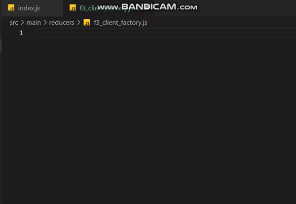

# Simple React Snippets

The essential collection of Folio3 Connector Snippets and commands.




## Snippets

| Snippet           | Renders                                       |
| ----------------- | --------------------------------------------- |
| `f3-fun`          | F3 Simple Function                            |
| `f3-class`        | F3 Class Function                             |
| `f3-arrow-fun`    | F3 Arrow Function                             |
| `udb`             | F3 Utility Debug                              |
| `f3-ss`           | F3 Schedule Script V1                         |

## Full Expansions

### f3-arrow-fun | F3 Arrow Function

```javascript
/**
* @description 
*/
const | = () => { 
    const logTitle = 'Untitled-1 => |'; 
    try { 
        Utility.logDebug(logTitle, 'START'); 
 
 
        Utility.logDebug(logTitle, 'END');
    } catch (e) { 
        Utility.logException(logTitle, e); 
    }
}
```

### f3-fun  | F3 Class Function

```javascript
| () { 
    const logTitle = 'Untitled-1 => |'; 
    try { 
        Utility.logDebug(logTitle, 'START'); 
 
 
        Utility.logDebug(logTitle, 'END');
    } catch (e) { 
        Utility.logException(logTitle, e); 
    }
}
```


### f3-fun  | F3 Simple Function

```javascript
function | () { 
    const logTitle = 'Untitled-1 => |'; 
    try { 
        Utility.logDebug(logTitle, 'START'); 
 
 
        Utility.logDebug(logTitle, 'END');
    } catch (e) { 
        Utility.logException(logTitle, e); 
    }
}
```


### udb | F3 Utility Debug

```javascript
Utility.logDebug(logTitle, JSON.stringify({ | }));
```

## Thank You! ❤️

© 2022 Shayan Shaikh.
